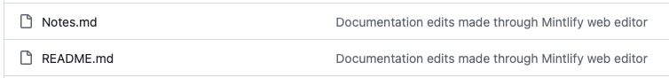

# My Note

## Mintlify Docs の編集方法

ちなみにこのファイルは"my note.mdx"です。

ターミナルでローカルのワーキングディレクリ（このプロジェクト）に移動し次のコマンドを実行します。

```bash
 mintlify dev --port 3333
```

ローカルサーバーが起動するのでブラウザで http://localhost:3333 を開きます。

GitHub（リモートレジストリ）には次のCommit文が追記されます。

